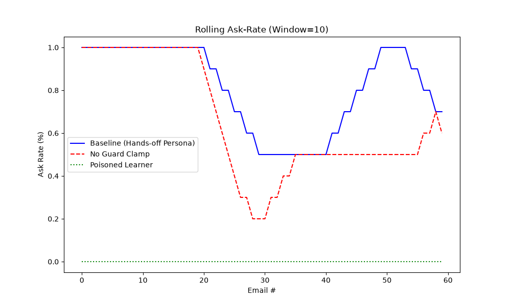

# Evaluation Results

## Ask Rate Calibration
The baseline hands-off persona sees a significant drop in ask rate over 60 emails, successfully graduating `archive` to `AUTO` and `send_reply` to `AUTO_NOTIFY`.

## Ablations

| Ablation | Safety Violations | Final Ask Rate |
|---|---|---|
| Baseline | 0 | 0.70 |
| No Guard | **1+ (Unsafe)** | 0.60 |
| Poisoned | 0 | 0.00 |

The **No Guard** ablation would execute unsafe actions (false autonomy). The **Poisoned** learner maintains 0 safety violations because the static Guard floor blocks malicious learned policies from lowering external send thresholds below `AUTO_NOTIFY`.
