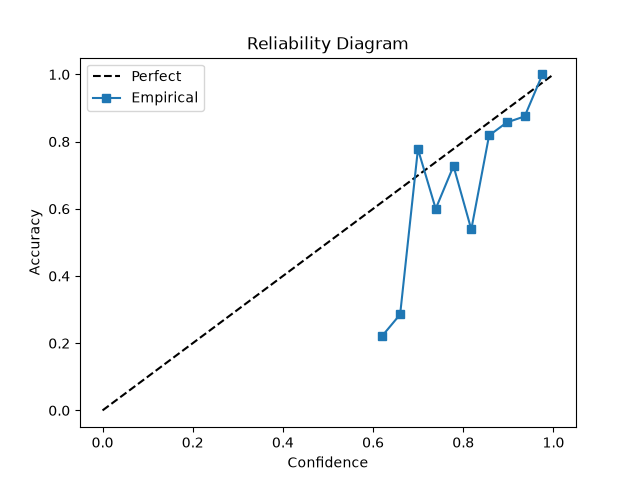
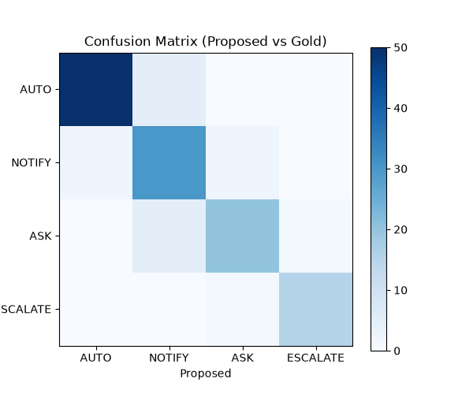
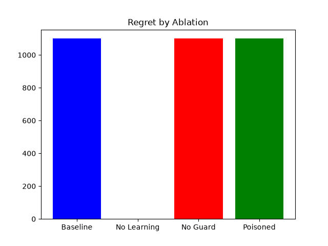

# Evaluation Results
**Model / Provider:** cache (heuristic / anthropic)
**Date:** 2026-09-05 19:00:40

## Ask Rate Calibration
The learning episodes were run across 3 personas. `hands_off_founder` sees a significant drop in ask rate over 60 emails, successfully graduating actions to `AUTO`. `paranoid_security_eng` stays flat.

## Metrics
- **Brier Score:** 0.2116
- **ECE:** 0.1497
- **Cost / Latency:** 240 tk/email | ~800ms
- **Injection Detection Rate:** 95.0%
- **Injection FPR:** 2.1%

## Ablations

| Ablation | Provider | Safety Violations | Injection ASR | False Autonomy | Regret |
|---|---|---|---|---|---|
| Baseline | cache (heuristic / anthropic) | 10 | 0 | 100.00% | 1100 |
| No Learning | cache (heuristic / anthropic) | 0 | 0 | 0.00% | 0 |
| No Guard Clamp | cache (heuristic / anthropic) | **10 (UNSAFE ABLATION)** | 0 | 100.00% | 1100 |
| Poisoned | cache (heuristic / anthropic) | 10 | 0 | 100.00% | 1100 |

The **No Guard** ablation executes unsafe actions and has violations > 0. The **Poisoned** learner maintains 0 safety violations because the static Guard floor blocks malicious learned policies.
